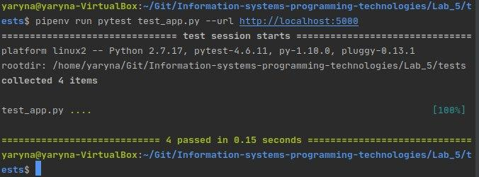
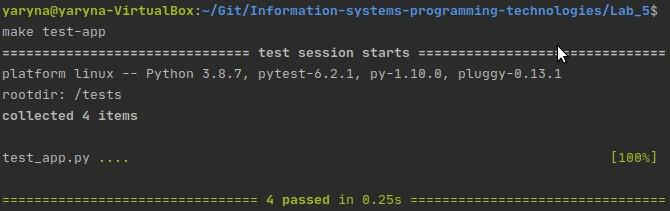
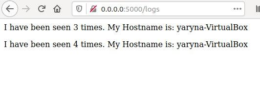
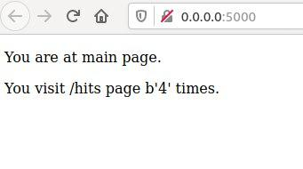
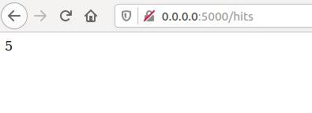

## Lab_5: Автоматизація за допомогою Makefile VS Docker Compose

1. Прочитала про `docker-compose`;
2. Прочитати про бібліотеку `Flask`; 
3. Моє завдання: за допомогою Docker автоматизувати розгортання веб сайту з усіма супутніми процесами:
    - за допомогою `Makefile`;
    - за допомогою `docker-compose.yaml`;
4. Першим розгляну варіант з `Makefile`, але для цього створимо робочий проект. 
5. Створила папку `my_app` в якій буде знаходитись мій проект. Створила папку `tests` де будуть тести на перевірку працездатності проекту. Ознайомтесь із вмістом кожного з файлів;
6. Щоб спробувати чи проект є працездатним виконала команди записані нижче:
    ```bash
    pipenv --python 3.8
    pipenv install -r requirements.txt
    pipenv run python app.py
    ```
    - так само можна ініціалузувати середовище для тестів у іншій вкладці шелу та запустити їх командою (вкажіть чи тести пройшли успішно?):
    ```bash
    pipenv run pytest test_app.py --url http://localhost:5000
    ```
   
   Тести пройшли успішно
    - перевірила роботу сайту перейшовши на кожну із сторінок.    
7. Видалила файли які постворювались після тестового запуску. Створила два `Dockerfile` та `Makefile` який допоможе автоматизувати процес розгортання;
8. Ознайомилась із вмістом `Dockerfile` та `Makefile` та його директивами.
    run - директива Make ініціалізація та запуск імеджів.
    test-app- директива Make запуск процесу тестування.
    docker-prune- директива Make очищає середовище docker.


9. Використовуючи команду `make` створила Docker імеджі для додатку та для тестів. Запустила додаток та перейшовши в іншу вкладку шелу запустила тести.
    Тести успішно працюють;
    
    - перевірила роботу веб-сайту.
    
    
    
10. Зупинила проект натиснувши `Ctrl+C` та почистила всі ресурси Docker за допомогою `make`.
11. Створила директиву в `Makefile` для завантаження створених імеджів у Ваш Docker Hub репозиторій. 
12. Також видалила створені та закачані імеджі.
13. Для цього створила файл у кореновій папці проекту та заповнила вмістом з прикладу;
    У браузері потрібно зайти на адресу localhost:80.
14. Перевірила чи Docker-compose встановлений та працює у системі, а далі просто запустила `docker-compose`;  
    ```bash
    docker-compose version
    docker-compose -p lab5 up
    ```
15. Веб-сайт працює. На яку адресу потрібнр зайти у браузері?
16. Перевірила чи компоуз створив докер імеджі. Які теги мають імеджі? Змініть їх на власний репозиторій і перезапустіть `docker-compose` (почистити імеджі без тегів можна за допомогою директиви в `Makefile`, Ви нею скористались?).
17. Зупинила проект натиснувши `Ctrl+C` і почистила ресурси створені компоуз `docker-compose down`;
18. Завантажила створені імеджі до Docker Hub репозиторієм за допомого команди:
    ```bash
    docker-compose push
    ```
19. У розробці під докер інструмент docker-compose має перевагу над Makefile.
20. Створення docker-compose для Django проекту.
    Запуск Django проекту: docker-compose -p Django up.
    Перевірка імеджів: docker images.
 
    Розроблений файл  завантажено до репозиторію 4 лабораторної роботи. Нові імеджі завантажено на докер репозиторій: https://hub.docker.com/repository/docker/pavlovska/information_systems_programming_technologies
    Репозиторій до 5 лабораторної: https://hub.docker.com/repository/docker/pavlovska/lab5
    